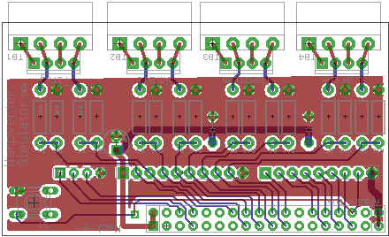

# Warpverter Simulator

The simulator reads the signals from a Warpverter of any kind, and produces an analog output that you can view using a Scope.  It can also capture a frame of data and send the data to a PC.

## Instruction

This PCB plugs into the 38 pin header of tha Aduno DUE.

Then plug the outputs of Tony's Inverter, or stm32_Warpverter, into the matching connectors of the simulator PCB.
Connect your oscilloscope to DAC0 of the DUE to see the synthesized waveform.

Press the button on the simulator PCB and it will grab a frame of data and send it (by USB) to your PC.  Using the Arduino IDE serial monitor is the easiest way.
